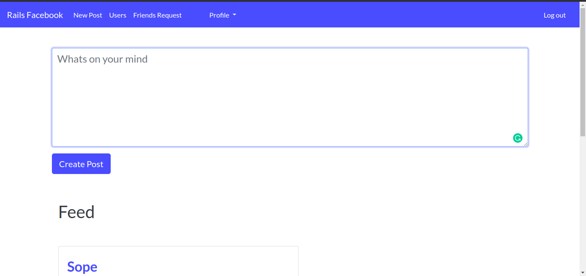

# Microverse Project Title - Final Project [Collaborative Project]
Ruby on Rails

### Introduction.
This project requests you to build a Facebook-like social network application.


## Functionalities

Can be found on:  ( <a href="https://www.theodinproject.com/courses/ruby-on-rails/lessons/final-project"> The odin final rails project </a>)

### Microverse Adjustments

* Skip points 16 about setting up a mailer - you will be able to do it if you complete extra task in next steps (which is optional).

* According to requirements first you should: “Think through the data architecture required to make this work. There are a lot of models and a lot of associations, so take the time to plan out your approach.” Keep that in your mind.

### Project specific




###  Ruby version

rbenv 2.6.5

###  System dependencies

Rails 6.0.2

Yarn 1.19.1

Ubuntu 18.04 & below

###  Database creation

* Database initialization

* How to run the test suite

* Services (job queues, cache servers, search engines, etc.)

* Deployment instructions

## Technologies

- HTML
- CSS
- Ruby
- Ruby on Rails

## Installation
> Open your git bash and **cd** to the location you'd like to put your files the run the command below.

```sh
$ git clone https://github.com/marcos-medeiros/rails-facebook.git
```

**cd** to into the project folder and install using `bundle install --withoutproduction`

```sh
$ cd rails-facebook
$ bundle insatll
```

`rails db:migrate`

To start the server: `rails server`

> visit: http://localhost:3000 to use the app

For Live version
> visit:  https://rails-fakebook-project.herokuapp.com

​## Authors
​
This project was executed by:
​
👤 **Marcos Medeioros **

- [Marcos Medeiros](https://www.linkedin.com/in/marcosmedeiros-dev/)

👤 **Damilola Ale**

- Email: _codenlyn@gmail.com_
- Github: [@damiecode](https://github.com/damiecode)
- Twitter: [@iamlildamski](https://twitter.com/iamlildamski)
- Linkedin: [Damilola Ale](https://www.linkedin.com/in/damiecode/)

## Contributing

1. Fork it (https://github.com/damiecode/rails-fakebook/fork)
2. Create your feature branch (git checkout -b feature/[choose-a-name])
3. Commit your changes (git commit -am 'what this commit will fix/add')
4. Push to the branch (git push origin feature/[chosen-name])
5. Create a new Pull Request

## Future features
- Improve UI
- Recieve notifications for posts from friends
- Forgot Password
- Account activation
- Photo/Video uplaod in posts
